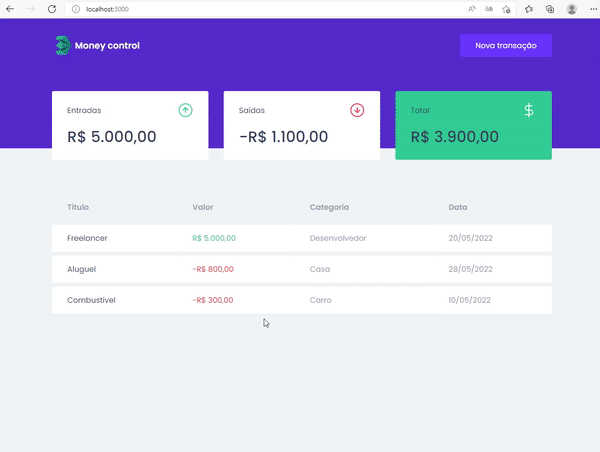

<div align="center">
  
</div>
<a href="https://rocketseat.com.br">
  
</a>

</br>
</br>

# 📝 Sobre

Money control é um sistema de controle de finanças pessoais, para gerir as contas de entradas e saídas, utilizando uma API Fake no MirajeJS. 
</br>
</br>

# 📁 Estrutura do projeto

- providers: A pasta contém alguns arquivos, que são responsaveis pelo consumo da API e gerenciamento.
- assets: A pasta contém arquicos de imagens que são renderiados no projeto.
- components : A pasta contém alguns componentes que são renderizados na tela principal.
- hooks: A pastar contém os hooks da aplicação.
- models: A pasta contém algumas tipagens, onde posso atribuir tipo na linguagem.
- styles: A pasta contém os estilos globais do projeto.

# 🎥 Vídeo

<div align="center">
    
</div>

# 🎨 Imagens

<div>
    
    
    
</div>

<br/>


# 🚀 Tecnologias utilizadas

- TypeScript
- JavaScript
- ReactJS
- MirageJS
- NodeJS
- NPM
- Axios
- Polished
- Styled Components

<br/>

# ✏️ Pré-requisitos

Para conseguir executar o projeto seguir as instruções, será necessário instalar os seguintes programas [NodeJS](https://nodejs.org/en/) e [Git](https://git-scm.com/).

<br/>

```bash
$ git clone https://github.com/Pedrofelipem/money-control.git

$ cd money-control

$ npm i

$ npm start
```

## Contato

Pedro Felipe

<div>
  <a href="https://www.linkedin.com/in/pedro-felipe-6184b0159/" target="_blank"></a>
  <a href = "mailto:pedrofelipem.contato@gmail.com"></a>
  <a href = "https://t.me/Pedrofelipem"></a>
</div>

#
